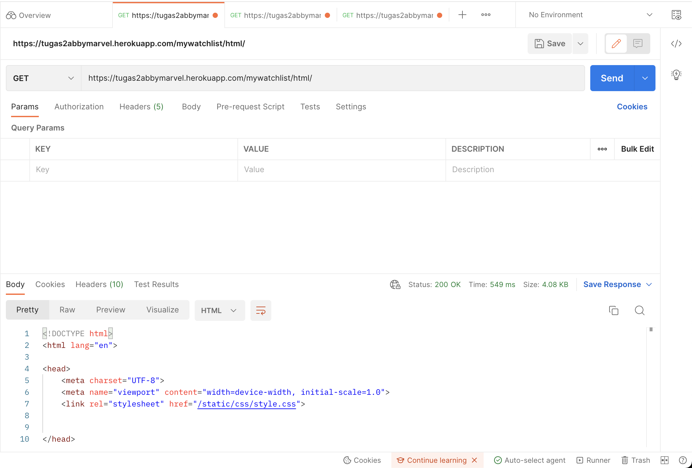
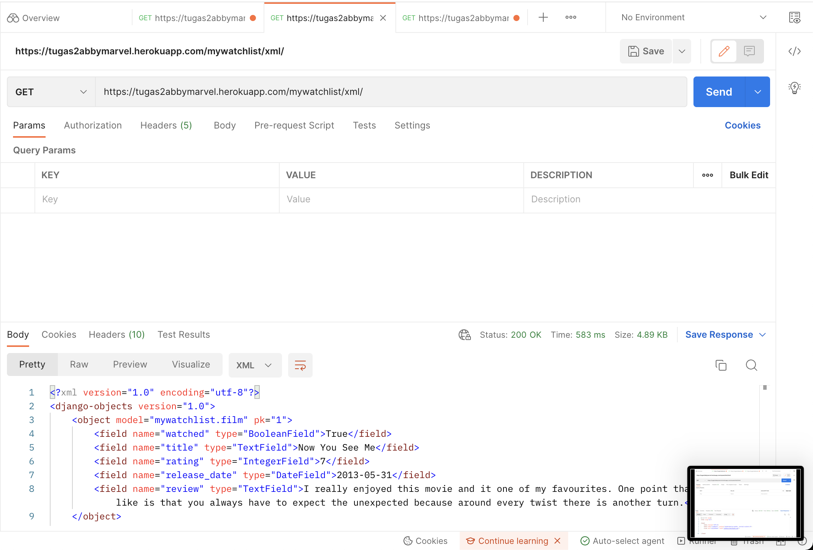
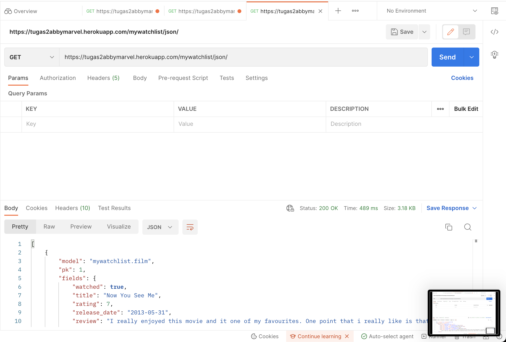

## TUGAS 3 PBP
### Abby Marvel Immanuel Parasian Pribadi
### 2106751796
### PBP-A

HTML  : https://tugas2abbymarvel.herokuapp.com/mywatchlist/html/

XML   : https://tugas2abbymarvel.herokuapp.com/mywatchlist/xml/

JSON  : https://tugas2abbymarvel.herokuapp.com/mywatchlist/json/

#### 1.  Jelaskan perbedaan antara JSON, XML, dan HTML!

HTML (Hyper Text Markup Language) : Used to create web pages and web applications. It is used for displaying the data not to transport the data.

XML (Extensible markup language)  : Designed to carry data, not to display data.

JSON (JavaScript Object Notation) : Lightweight data-interchange format and it completely language independent. It is based on the JavaScript programming language and easy to understand and generate.

#### 2. Jelaskan mengapa kita memerlukan data delivery dalam pengimplementasian sebuah platform?

Data delivery adalah sumber dari informasi yang akan ditampilkan pada suatu platform, sehingga data delivery merupakan hal yang krusial dalam pengimplementasian sebuah platform.

#### 3. Jelaskan bagaimana cara kamu mengimplementasikan checklist di atas!

    1) Menambahkan path mywatchlist sehingga pengguna dapat mengakses http://localhost:8000/mywatchlist dengan command (python3 manage.py startapp mywishlist).
    2) Membuat sebuah model MyWatchList yang memiliki atribut watched, title, rating, release_date, dan review.
    3) Menambahkan 10 data untuk objek MyWatchList yang sudah dibuat di atas.
    4) Mengimplementasikan sebuah fitur untuk menyajikan data yang telah dibuat sebelumnya dalam format html, xml, dan json.
    5) Membuat routing sehingga data di atas dapat diakses melalui URL.
    6) Melakukan deployment ke Heroku.

#### Screenshoot dari Postman:

HTML:

XML:

JSON:

